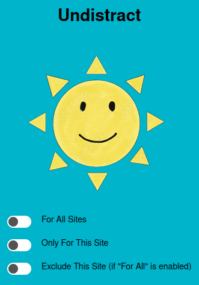

⚪⚫ Undistract Browser Extension ⚫⚪

The "Undistract" extension is a browser extension designed to improve your concentration and reduce distractions while browsing the Internet. The extension applies a gray filter to web pages, creating a more soothing browsing experience.

🔥 Features

- Apply the gray filter to all websites + make exceptions if you want
- One website only
- Ergonomic user interface

> Youtube and 99.9% websites compatible

